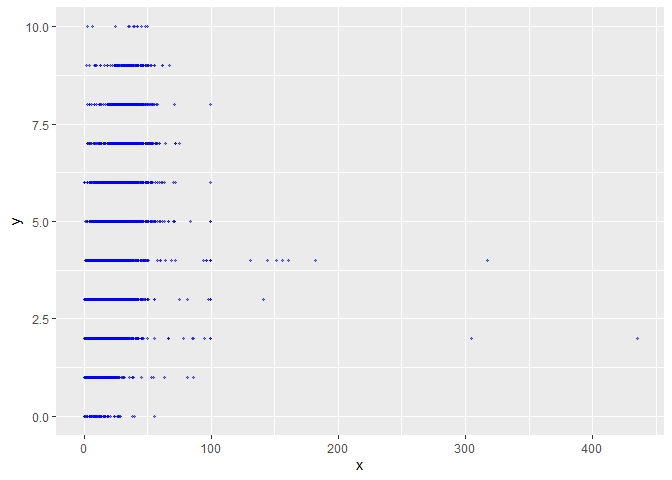
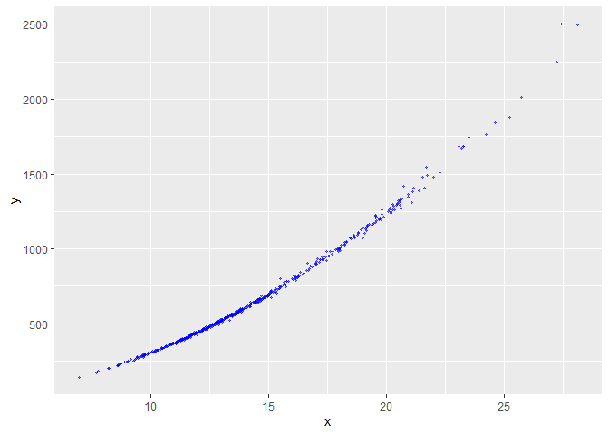
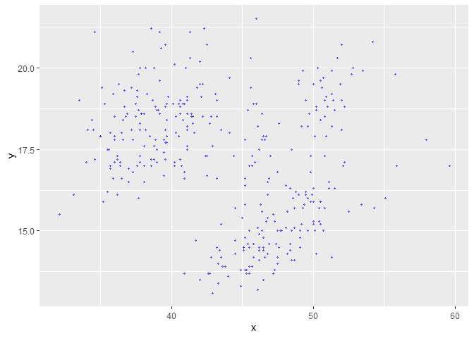

Stat545B_A1
================
Nicole
2023-10-29

## Stat 545B - Assignment 1

\#Excercise 1

``` r
#loading libraries 
library(tidyverse)
```

    ## Warning: package 'tidyverse' was built under R version 4.2.3

    ## Warning: package 'ggplot2' was built under R version 4.2.3

    ## Warning: package 'tibble' was built under R version 4.2.3

    ## Warning: package 'tidyr' was built under R version 4.2.3

    ## Warning: package 'readr' was built under R version 4.2.3

    ## Warning: package 'purrr' was built under R version 4.2.3

    ## Warning: package 'dplyr' was built under R version 4.2.3

    ## Warning: package 'stringr' was built under R version 4.2.3

    ## Warning: package 'forcats' was built under R version 4.2.3

    ## Warning: package 'lubridate' was built under R version 4.2.3

    ## ── Attaching core tidyverse packages ──────────────────────── tidyverse 2.0.0 ──
    ## ✔ dplyr     1.1.3     ✔ readr     2.1.4
    ## ✔ forcats   1.0.0     ✔ stringr   1.5.0
    ## ✔ ggplot2   3.4.3     ✔ tibble    3.2.1
    ## ✔ lubridate 1.9.2     ✔ tidyr     1.3.0
    ## ✔ purrr     1.0.2     
    ## ── Conflicts ────────────────────────────────────────── tidyverse_conflicts() ──
    ## ✖ dplyr::filter() masks stats::filter()
    ## ✖ dplyr::lag()    masks stats::lag()
    ## ℹ Use the conflicted package (<http://conflicted.r-lib.org/>) to force all conflicts to become errors

``` r
library(ggplot2)
library(datateachr)
library(testthat)
```

    ## Warning: package 'testthat' was built under R version 4.2.3

    ## 
    ## Attaching package: 'testthat'
    ## 
    ## The following object is masked from 'package:dplyr':
    ## 
    ##     matches
    ## 
    ## The following object is masked from 'package:purrr':
    ## 
    ##     is_null
    ## 
    ## The following objects are masked from 'package:readr':
    ## 
    ##     edition_get, local_edition
    ## 
    ## The following object is masked from 'package:tidyr':
    ## 
    ##     matches

``` r
#Exercise 1: Make a Function

#The function I choose to make is a plot which I used a lot in the Stat545 mda. This function creates a standard scatterplot. 

easyplot <- function(x, y) {
    xnum <- x[!is.na(x)]
    if(!is.numeric(xnum)) {
    stop('please input a numeric variable')
  }
  ggplot(mapping = aes(x, y)) + 
  geom_point(size = 0.8, alpha = 0.5, color = "blue") 
}

#xnum = na would deem it numeric, made a vector with no nas 

easyplot(x = vancouver_trees$diameter, y = vancouver_trees$height_range_id)
```

<!-- -->

``` r
#Exercise 2: Document your Function


easyplot <- function(x, y) {
    xnum <- x[!is.na(x)]
    if(!is.numeric(xnum)) {
    stop('please input a numeric variable')
  }
  ggplot(mapping = aes(x, y)) + 
  geom_point(size = 0.8, alpha = 0.5, color = "blue") 
}

#' easyplot
#' @description This function creates a standard scatter plot with 0.8 size blue points using ggplot. This function makes it easy to create a plot to look at the relationship between two numerical variables in a dataset.
#' @param x A numerical variable in a dataset.
#I named this variable x to describe the independent variable being investigated
#' @param y A numerical variable in a dataset.
#I named this variable y to describe the dependent variable being investigated 
#'
#' @return A blue scatter plot using two numerical variables on the x and y axis  
```

``` r
#Exercise 3: Include examples 

easyplot(vancouver_trees$diameter, vancouver_trees$height_range_id)
```

<!-- -->

``` r
#I want to look at the relationship between diameter and height of trees using the vancouver trees dataset, I am using the easyplot function to quickly see if there is a pattern between these variables. I can see that the shorter/mid height trees tend to be the tallest. 
```

``` r
easyplot(cancer_sample$radius_mean, cancer_sample$area_mean)
```

<!-- -->

``` r
#I want to look at the relationship between tumor mean radius and tumor mean area using the cancer sample dataset, I am using the easyplot function to quickly see if there is a pattern between these variables. The results show a positive correlation.  
```

``` r
easyplot(palmerpenguins::penguins$bill_length_mm,palmerpenguins::penguins$bill_depth_mm)
```

    ## Warning: Removed 2 rows containing missing values (`geom_point()`).

<!-- -->

``` r
#I want to look at the relationship between penguin bill length and penguin bill depth using the palmer penguins dataset, I am using the easyplot function to quickly see if there is a pattern between these variables. There doesn't seem to be a clear pattern between these variables. 
```

``` r
#Exercise 4: Test the Function

test_that("Function creates a ggplot",{
  ep <- easyplot(cancer_sample$radius_mean, cancer_sample$area_mean)
  expect_is(ep,"ggplot")
})
```

    ## Test passed 🥇

``` r
test_that("Function uses the correct given dataset", {
  ep <- easyplot(cancer_sample$radius_mean, cancer_sample$area_mean)
  expect_that(easyplot(cancer_sample$radius_mean, cancer_sample$area_mean), equals(ep))
}) 
```

    ## Test passed 🌈

``` r
test_that("Function needs a dataset and varibles, not just a string of numbers", {
  expect_error(easyplot(2,3,4))
})
```

    ## Test passed 🎉

``` r
test_that("Function can only use numerical dataset", {
  expect_error(easyplot(vancouver_trees$species_name, vancouver_trees$std_street))
})
```

    ## Test passed 😸
